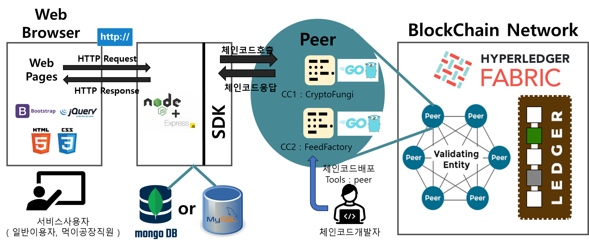
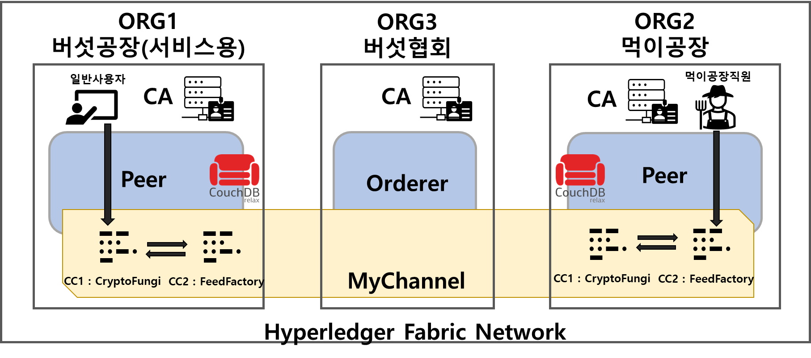

# CryptoFungi Project 설명 및 실행 방법
## 프로젝트 개요
분야 : 자산관리 및 거래 & 수집형 게임

주제 : 가상버섯 관리 및 거래가 가능한 NFT 프로젝트

## 실행환경
Oracle VM image : ubuntu2004_fabric 2.2LTS.ova

Downloadlink : https://ajouackr-my.sharepoint.com/:u:/g/personal/bc8c_ajou_ac_kr/EcYRGAOnihhFps8AzS_YPsABMuM-DFG3KVgSigCmHrJhqg?e=ZNhAMp

## 프로젝트 기술 목록

블록체인 플랫폼 : Hyperledger Fabric v2.2.3

체인코드 : golang

웹서버 : Node.js ( express module ) + ejs (view engine)

DataBase : JSON file I/O

Fron : HTML + CSS(Bootstrap) + javascript

## 프로젝트 시스템 아키텍처

## 프로젝트 실행 방법

### 1. Blockchain Network 실행
실행명령어 : ./startNetwork.sh
 - ORG1.peer0 의 couchdb 접속 주소 : localhost:5984/_utils
 - couchdb id/pw : admin/adminpw

네트워크 구조 : 

### 2. ChainCode 설치/배포
실행명령어 : ./deplocyCC.sh

### 3. ChainCode 테스트
실행명령어 : ./TestFungusfactory.sh -> ./TestFeedfactory.sh -> ./TestFungusfactory2.sh

### 4. Application 실행
실행명령어 : ./startApplication.sh
- 웹페이지 접속 주소 :  localhost:3000

### 5. 프로젝트 종료 ( 네트워크 종료 및 초기화 )
실행명령어 : ./downNetwork.sh